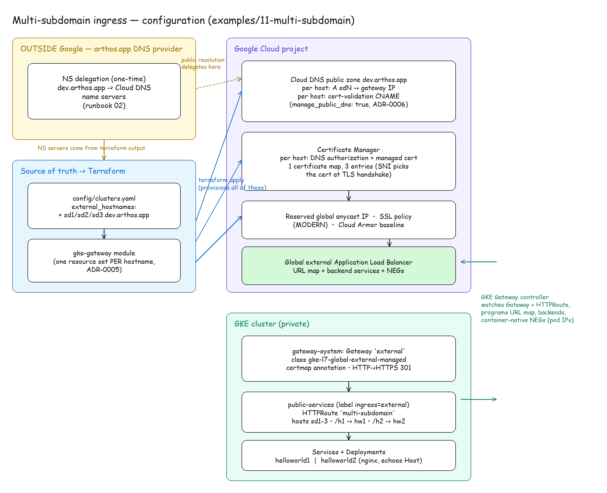
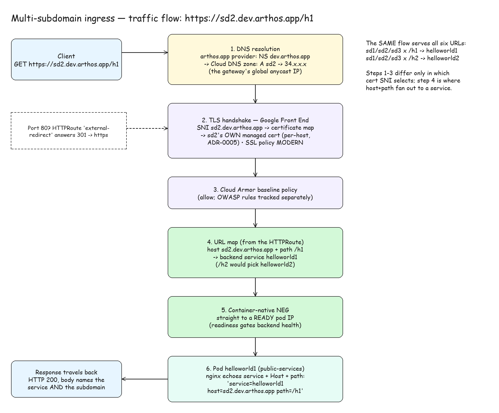

# 11 — Multi-subdomain routing (case 14): three subdomains, two services, path fan-out

Two web services — `helloworld1` and `helloworld2` — served over HTTPS through
the **same** public gateway on **three** subdomains, with the URL path picking
the service:

| URL | Lands on |
|---|---|
| `https://sd1.dev.arthos.app/h1` | helloworld1 |
| `https://sd2.dev.arthos.app/h1` | helloworld1 |
| `https://sd3.dev.arthos.app/h1` | helloworld1 |
| `https://sd1.dev.arthos.app/h2` | helloworld2 |
| `https://sd2.dev.arthos.app/h2` | helloworld2 |
| `https://sd3.dev.arthos.app/h2` | helloworld2 |

Every response names both the service and the subdomain the request travelled
through (nginx echoes the Host header), so the routing is observable end to
end:

```
$ curl https://sd2.dev.arthos.app/h1
service=helloworld1 host=sd2.dev.arthos.app path=/h1
```

Certificates are **per subdomain**: each of `sd1`/`sd2`/`sd3` gets its own
publicly-trusted Google-managed certificate, and the load balancer serves the
right one by Server Name Indication (SNI). A single certificate carrying all
three names as Subject Alternative Names (SANs) was considered and rejected —
[ADR-0005](../../docs/adr/0005-multi-host-gateways-no-wildcards.md) chose
per-hostname certificates so hostnames can be added/removed independently and
no certificate ever lists names it does not serve.

Diagrams (PNG renders below; the editable sources are the `.excalidraw` files
next to them — open with [excalidraw.com](https://excalidraw.com) or the
VS Code Excalidraw extension):

**Configuration** — how the pieces are provisioned and wired (Terraform →
Google resources → in-cluster objects) ([source](configuration.excalidraw)):



**Traffic flow** — the request path from the client to the pod, step by step
([source](traffic-flow.excalidraw)):



## How it is configured — the Google ecosystem parts

Everything below is provisioned by **Terraform**, driven by one line of
config: the three hostnames appended to `external_hostnames` for the dev-fop
cluster in [`config/clusters.yaml`](../../config/clusters.yaml). The
cluster-factory regenerates the root, and `terraform apply` fans that list out
through the [`gke-gateway` module](../../terraform/modules/gke-gateway/main.tf)
(ADR-0005: *adding an app is adding an entry*).

Per hostname (× 3):

1. **Certificate Manager DNS authorization** — proves domain control for
   certificate issuance. Emits one validation CNAME record.
2. **Certificate Manager managed certificate** — the publicly-trusted cert for
   that one hostname. Google renews it automatically.
3. **Certificate map entry** — maps the hostname to its certificate inside the
   gateway's single certificate map (`external-certmap`), which the Gateway
   references via its `networking.gke.io/certmap` annotation. SNI picks the
   entry at handshake time.
4. **Cloud DNS records** (because dev runs `manage_public_dns: true`,
   ADR-0006): the hostname's `A` record pointing at the gateway's reserved
   global IP, plus the DNS-authorization CNAME from step 1 — both written
   into the Cloud DNS public zone `dev.arthos.app` automatically.

Shared by all hostnames (already existed; unchanged by this example):

- **Reserved global IP** — the anycast address the `A` records point at.
- **Gateway `external`** in `gateway-system` (class
  `gke-l7-global-external-managed` — Google's global external Application
  Load Balancer), with an HTTP→HTTPS 301 redirect route and an SSL policy
  (MODERN profile) attached via `GCPGatewayPolicy`.
- **Cloud Armor** baseline security policy.
- **Cloud DNS public zone** `dev.arthos.app`.

In-cluster (this example's manifest, [`ingress.yaml`](ingress.yaml)):

- Two hardened single-replica Deployments + ClusterIP Services
  (`helloworld1`, `helloworld2`) in `public-services` — the namespace whose
  `ingress=external` label permits attaching routes to the external gateway.
- One **HTTPRoute** claiming all three hostnames with two path rules:
  `PathPrefix /h1` → helloworld1, `PathPrefix /h2` → helloworld2. The GKE
  Gateway controller translates this into URL-map host+path rules and
  container-native Network Endpoint Groups (NEGs) pointing at pod IPs.

## What lives outside — the arthos.app DNS provider

Exactly **one** record, and it is one-time (not per hostname): the `NS`
delegation of `dev.arthos.app` to the Cloud DNS zone's name servers
(`terraform output public_zone_name_servers`; see
[runbook 02](../../docs/runbooks/02-cluster-bringup.md)). Once the subdomain
is delegated, every new hostname — including the three added here — needs
**no** action at the provider: Terraform writes the `A` and cert-validation
records into the delegated zone, and Certificate Manager takes the
certificate to `ACTIVE` on its own (typically minutes, up to ~1 h on first
issuance).

If delegation were ever withdrawn (`manage_public_dns: false`), the same two
records per hostname would instead be created manually at the provider, from
`terraform output dns_records`.

## Run / clean up (standalone)

```bash
examples/validate.sh --only multi-subdomain            # deploy, assert all 6 URLs, auto-clean
examples/validate.sh --only multi-subdomain --keep     # leave it running for inspection
examples/validate.sh --cleanup --only multi-subdomain  # tear down just this example
```

The check curls all six host+path combinations with `--resolve` pinned to the
gateway IP (public DNS propagation stays off the critical path), verifies each
host's certificate (no `-k`), and asserts the body names the right service and
subdomain.
